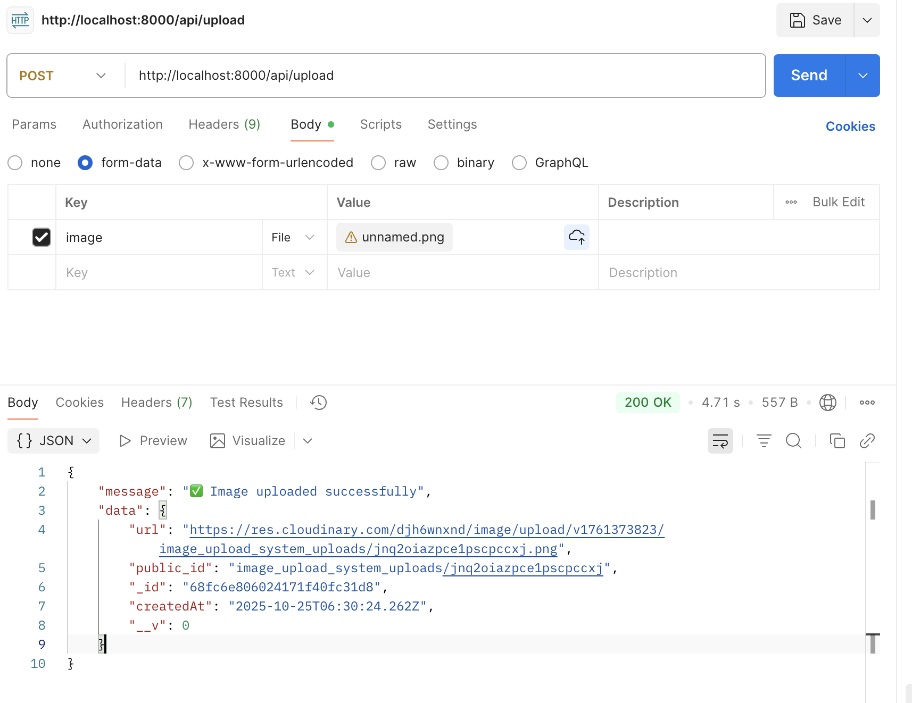

# Image Upload System

ระบบอัปโหลดรูปภาพขึ้น Cloudinary และบันทึกข้อมูลลง MongoDB  
พร้อม Frontend (HTML/CSS/JS) สำหรับอัปโหลด แสดง และลบรูปแบบเรียลไทม์

---

## ตัวอย่างการอัปโหลด (POST)


---

## Features
- อัปโหลดรูปภาพขึ้น Cloudinary ผ่าน API `/api/upload`
- บันทึก URL ลง MongoDB
- ดึงรายการรูปทั้งหมดจาก `/api/images`
- ลบรูปได้จาก `/api/images/:id`
- มีหน้าเว็บ Frontend ใช้งานง่าย (HTML + CSS + JS)
- เก็บค่า key ทั้งหมดใน `.env` อย่างปลอดภัย

---

## โครงสร้างโปรเจกต์


image_upload_system/
│
├── .env
├── package.json
├── server.js
│
├── models/
│   └── Image.js
│
├── routes/
│   └── uploadRoutes.js
│
├── frontend/
│   ├── index.html
│   ├── style.css
│   └── script.js
│
└── POST.png

````

---

## การตั้งค่าเบื้องต้น

### 1. ติดตั้ง dependencies
```bash
npm install
````

### 2. ตั้งค่าไฟล์ `.env`

```env
PORT=8000
MONGODB_URI=mongodb+srv://<user>:<password>@name.mongodb.net/image_upload_system
CLOUDINARY_CLOUD_NAME=
CLOUDINARY_API_KEY=
CLOUDINARY_API_SECRET=
```

> ห้ามแชร์ไฟล์ `.env` ลง GitHub

---

### 3. รันเซิร์ฟเวอร์

```bash
npm start
```

Server จะรันที่
`http://localhost:8000`

---

## การใช้งาน Frontend

1. เปิดไฟล์ `frontend/index.html` ด้วย browser
2. เลือกรูปและกด Upload
3. ระบบจะส่งคำขอ POST ไปยัง `/api/upload`
4. เมื่ออัปโหลดสำเร็จ รูปจะปรากฏในหน้าเว็บทันที

---

## API Endpoints

| Method | Endpoint          | Description                  |
| ------ | ----------------- | ---------------------------- |
| POST   | `/api/upload`     | อัปโหลดรูปภาพขึ้น Cloudinary |
| GET    | `/api/images`     | ดึงรายการรูปทั้งหมด          |
| DELETE | `/api/images/:id` | ลบรูปภาพตาม `_id` ใน MongoDB |

---

## Tech Stack

* Backend: Node.js, Express
* Database: MongoDB (Mongoose)
* Storage: Cloudinary
* Frontend: HTML, CSS, JavaScript
* Other: Multer, CORS, dotenv

---

## ผู้พัฒนา

**Thanakit Chuchoed (ธนกฤต ชูเชิด)**
University of Phayao
GitHub: [@faryporza](https://github.com/faryporza)

```

---

คุณสามารถวางไฟล์นี้ไว้ในรากของโปรเจกต์ (`image_upload_system/README.md`)  
และใส่ไฟล์ `POST.png` ไว้ในโฟลเดอร์เดียวกันได้เลยครับ  
GitHub จะแสดงภาพตัวอย่างให้โดยอัตโนมัติ
```
